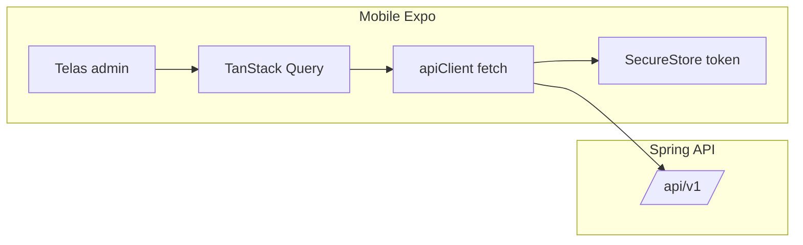

# Migração admin (Angular) para app React Native

## Contexto no repositório

| Área | Onde está hoje |
|------|----------------|
| App móvel | [mobile/](mobile/) — Expo ~54, Expo Router, React 19 / RN 0.81 ([mobile/package.json](mobile/package.json)), sem cliente HTTP nem estado de servidor ainda ([mobile/app/_layout.tsx](mobile/app/_layout.tsx)). |
| Referência admin | [frontend/src/app/features/admin/](frontend/src/app/features/admin/) — login, agenda, serviços, clientes, horários, despesas, usuários root. Rotas em [frontend/src/app/app.routes.ts](frontend/src/app/app.routes.ts) (`/admin/...`). |
| API Java | Base `http://localhost:8080/api/v1` em [frontend/src/environments/environment.ts](frontend/src/environments/environment.ts). Contratos espelhados nos serviços em [frontend/src/app/core/services/](frontend/src/app/core/services/). |
| Modelos | [frontend/src/app/core/models/salon.models.ts](frontend/src/app/core/models/salon.models.ts) e [frontend/src/app/core/models/pagination.models.ts](frontend/src/app/core/models/pagination.models.ts). |

**Escopo explícito:** trazer para o app apenas o que existe hoje em `features/admin` (e evolução futura “empresa” alinhada a `companyId` no JWT em [frontend/src/app/core/services/auth.service.ts](frontend/src/app/core/services/auth.service.ts)). **Fora de escopo:** `client`, `public`, fluxos root fora do menu admin (exceto se forem necessários por papel ROOT).

---

## Diferença de produto: web admin vs app

- **Web:** telas largas, calendário semanal com colunas e blocos absolutos ([frontend/src/app/features/admin/appointments/appointment-calendar/appointment-calendar.ts](frontend/src/app/features/admin/appointments/appointment-calendar/appointment-calendar.ts)), listagem paginada, muitos modais lado a lado.
- **App:** priorizar leitura rápida, ações de funcionário (confirmar, reagendar, bloquear), formulários em steps ou modais nativos; a **mesma API** e as **mesmas regras de negócio** (horário efetivo = override + dia da semana) devem ser reutilizadas, idealmente com **lógica pura compartilhável** extraída do componente Angular (ver abaixo).

---

## Pontos críticos (prioridade alta)

1. **Configuração de horários + exceções** — [frontend/src/app/core/services/schedule.service.ts](frontend/src/app/core/services/schedule.service.ts): `GET/PUT /schedule/config`, `GET/PUT /schedule/overrides`, resolução `getConfigForDate`. No admin, [frontend/src/app/features/admin/schedule/schedule.component.ts](frontend/src/app/features/admin/schedule/schedule.component.ts) ainda faz **detecção de conflito** ao fechar um dia (`getActiveByDate` + `cancelAppointmentsByDate` + modal de confirmação). Isso deve ser replicado com fidelidade no app.
2. **Agenda admin** — [frontend/src/app/features/admin/appointments/appointments.component.ts](frontend/src/app/features/admin/appointments/appointments.component.ts): listagem paginada, modais de criar/editar/cancelar/concluir, alternância lista/calendário; integração com `ScheduleService` para bounds e bloqueios no calendário.
3. **Autenticação** — login admin `POST /auth/login`, JWT em storage, header `Authorization` (equivalente a [frontend/src/app/core/interceptors/auth.interceptor.ts](frontend/src/app/core/interceptors/auth.interceptor.ts)); no RN usar **expo-secure-store** (ou similar) em vez de `localStorage`.
4. **Papéis** — `ROOT` vs `ADMIN`: rota `users` só para root no web; no app, esconder abas/rotas conforme claims do JWT (mesma lógica que [frontend/src/app/core/guards/admin.guard.ts](frontend/src/app/core/guards/admin.guard.ts) e layout admin).

---

## Calendário: biblioteca vs custom

**O que o web faz hoje:** grade **semanal customizada** (7 dias, faixa de horas derivada de `ScheduleService`, intervalos de 30 min, bloqueios de fora do expediente/pausas, cards de agendamento com posição/altura por minutos). Não é um componente de calendário de terceiros.

**Sugestão (para alinharmos na implementação):**

- **Linha do tempo semanal (paridade com o admin web):** implementação **custom em RN** (`ScrollView` horizontal para dias + vertical para horas, posicionamento com `top`/`height` como hoje, ou `FlashList` se performance exigir). Motivo: sobreposição de “fechado”, **breaks** e agendamentos com as mesmas regras já codificadas no Angular é o que bibliotecas genéricas mais costumam **não** cobrir sem hacks.
- **Auxiliares:** para **só** escolher data (ex.: filtro, override), pode-se usar um date picker leve (`@react-native-community/datetimepicker`) ou uma lib de **grade mensal** se quiser UX extra — sem substituir a timeline principal.

**Alternativa** se quiser menos código de layout: avaliar bibliotecas tipo **timeline/calendar kit** depois de um spike de 0.5–1 dia verificando se suportam: múltiplas colunas (dias), eventos com altura variável, e **camadas de overlay** para fora de expediente. Se não passar no spike, volta ao custom (recomendação padrão acima).

**Refino de longo prazo:** extrair funções puras (`calendarBounds`, `clickableSlots`, `getUnavailableBlocksForDay`, etc.) para um pacote `shared/` ou `packages/schedule-logic` consumido pelo Angular e pelo RN, para uma única fonte da verdade (opcional, após primeira versão no app).

---

## Comunicação com a API (estrutura desejada)

**Referência atual no Angular:** [frontend/src/app/core/services/api.service.ts](frontend/src/app/core/services/api.service.ts) — `get/post/...` com contador global `activeRequests` + `isLoading` signal; os serviços de domínio retornam `Observable` e em vários casos mantêm `signal` próprio (ex.: [schedule.service.ts](frontend/src/app/core/services/schedule.service.ts)).

**Para o mobile (recomendação alinhada ao pedido “loading junto com response”):**

- **`apiClient`:** funções finas `request<T>(path, init)` com `baseUrl` ([environment](frontend/src/environments/environment.ts)), serialização JSON, leitura do token do secure store, tratamento de 401 (logout / refresh futuro).
- **TanStack Query (`@tanstack/react-query`):** cada endpoint vira `useQuery` / `useMutation` com estado **`data`, `isLoading`, `isFetching`, `isError`, `error`, `refetch`** sem `useState` manual por tela. Mutations invalidam queries (`queryClient.invalidateQueries(['appointments'])`).
- **Spinner global (opcional):** `useIsFetching()` no root layout — equivalente ao `ApiService.isLoading` do Angular, sem misturar com o estado por query.
- **“Caches” tipo ScheduleService:** implementar como **query keys** + `queryClient.setQueryData` após PUT, ou hooks que leem `select` a partir das queries de `/schedule/config` e `/schedule/overrides`, em vez de signals soltos.

Arquivos-alvo no mobile (a criar na implementação): algo como `mobile/src/api/client.ts`, `mobile/src/api/queryClient.ts`, `mobile/app/_providers.tsx` envolvendo `QueryClientProvider`, e pastas `mobile/src/features/<nome>/api.ts` ou hooks por domínio.

---

## Ordem sugerida das features (uma de cada vez)

Cada fase pode terminar com revisão sua antes da próxima.

| Fase | Entrega | Dependências de API (referência Angular) |
|------|---------|------------------------------------------|
| 0 | Documentação na pasta `.doc/` (ver abaixo) + checklist | — |
| 1 | Config: `app.config` / env, `apiClient`, QueryClient, provider, tipos copiados/adaptados de `salon.models` + paginação | — |
| 2 | Auth admin: login, guarda de token, layout autenticado vs login | `auth.service` |
| 3 | Navegação admin (tabs/stack Expo Router) espelhando menu web | `admin-layout` |
| 4 | Serviços (catálogo) | `salon.service` |
| 5 | Clientes | `client.service` |
| 6 | Despesas | `expense.service` |
| 7 | Usuários sistema (só ROOT) | `system-user.service` |
| 8 | **Schedule** (crítico) | `schedule.service` + partes de `appointment.service` para conflitos |
| 9 | **Agendamentos** (lista + modais + calendário custom) | `appointment.service` + lógica do calendário |

Ordem 8 antes de 9 facilita testar a agenda com dados reais de horário; se preferir valor rápido, 9 pode vir antes **desde** que mocks ou defaults de horário existam — documentar essa escolha no README da migração.

---

## Documentação (pasta nova em `.doc/`)

Criar uma pasta dedicada, por exemplo: **[`.doc/migracao-mobile-admin/`](.doc/migracao-mobile-admin/)**, contendo (nomes sugeridos):

- `README.md` — visão, escopo, links para os demais arquivos.
- `comparativo-angular-expo.md` — módulo a módulo (admin), o que muda de UX no app.
- `api-e-estado.md` — `apiClient`, React Query, convenção de query keys, 401, env.
- `agenda-e-horarios.md` — fluxos críticos (override, conflito ao fechar dia), decisão calendário custom vs lib, spike se houver.
- `checklist-por-feature.md` — checkboxes por fase (1–9) para pausar/revisar entre elas.

Nada disso altera código até você aprovar o plano; na execução, seguir a ordem do checklist.
