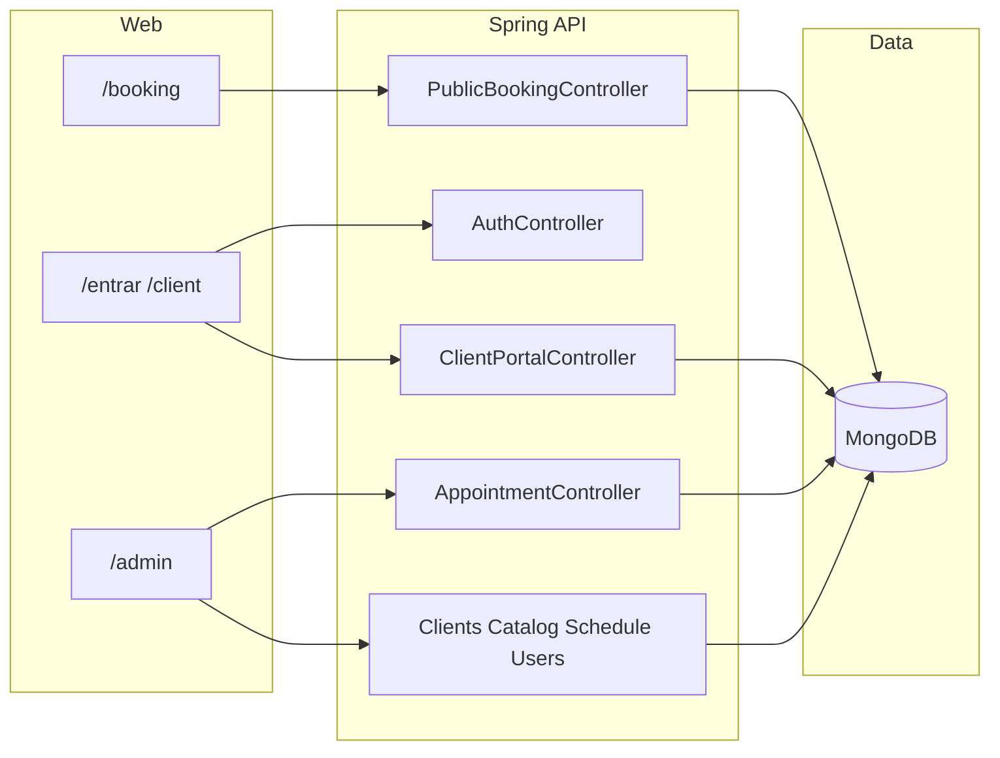

# Contexto do projeto BelezaPro

## O que é o produto

Plataforma de **agendamento automatizado** para serviços de beleza/cuidados dos pés e mãos. Há três experiências principais na web:

- **Reserva pública** (`/booking`): cliente escolhe serviços, horário e confirma sem conta tradicional (fluxo público da API).
- **Portal do cliente** (`/entrar` + `/client`): login por **OTP** e gestão dos próprios agendamentos.
- **Painel admin** (`/admin`): calendário/lista de agendamentos, clientes, catálogo de serviços, grade semanal e exceções, usuários (área restrita a **root**), e **despesas** (hoje só no browser).

A descrição oficial está em [frontend/README.md](frontend/README.md). **Observação:** o README ainda cita SQLite/Express para SSR/API; o backend deste monorepo é **Spring Boot + MongoDB** — vale alinhar documentação quando for conveniente.

---

## Layout do monorepo

| Pasta | Papel |
|--------|--------|
| [backend/](backend/) | API REST (Java 21, Spring Boot 4.x, MongoDB, JWT, mail, Springdoc). |
| [frontend/](frontend/) | Angular 21 (standalone, signals, zoneless), Material, Tailwind 4, Vitest. |
| [.doc/](.doc/) | Bruno collections, planos de ação, notas internas (não é código de runtime). |
| [docker-compose.yml](docker-compose.yml) | MongoDB para desenvolvimento local. |

Não há app mobile nem worker separado neste repositório.

---

## Stack resumida

**Backend:** Spring Web, Spring Data MongoDB, Spring Mail, `java-jwt`, Lombok. Segurança customizada em torno de JWT (não Spring Security “full stack” no `build.gradle` — há `spring-security-crypto`).

**Frontend:** Angular 21, rotas lazy-loaded, guards (`adminGuard`, `clientGuard`, `rootGuard`). Arquitetura em camadas: `core` (serviços singleton, guards), `shared`, `features` — detalhes em [frontend/docs/architecture.md](frontend/docs/architecture.md).

**Dados:** persistência principal no **MongoDB**. A feature **despesas** no admin usa **localStorage** no cliente ([frontend/src/app/core/services/expense.service.ts](frontend/src/app/core/services/expense.service.ts)), sem espelho na API Java.

---

## Backend: domínios e APIs

Pacote base: `com.belezapro.belezapro_api`, com `config`, `common` e **`features`**:

- **appointments** — núcleo do agendamento; inclui fluxo **público** (`PublicBookingController` em `/api/v1/public`) e portal cliente (`ClientPortalController`).
- **authentication** — JWT, OTP, e-mail; `AuthController`.
- **clients**, **companies**, **users** — cadastros e papéis (ex.: root).
- **schedule** — disponibilidade, overrides, slots ocupados.
- **services** — catálogo (`CatalogController`).

Documentação OpenAPI via Springdoc; contratos manuais também em `.doc/bruno/`.

---

## Frontend: rotas principais

Fonte: [frontend/src/app/app.routes.ts](frontend/src/app/app.routes.ts).

| Rota | Função |
|------|--------|
| `''` | Seleção de fluxo (auth pública). |
| `login` | Login admin. |
| `booking` | Landing de agendamento público. |
| `entrar` | OTP cliente. |
| `client/*` | Área cliente (guard): `appointments`. |
| `admin/*` | Área admin (guard): `appointments`, `services`, `clients`, `schedule`, `expenses`; `users` só com `rootGuard`. |

Serviços típicos em `frontend/src/app/core/services/`: `api.service`, `auth.service`, `appointment.service`, `public-booking.service`, `client-portal.service`, `schedule.service`, etc.

---

## Como seguir daqui

Para tarefas futuras, o caminho natural é: **especificar feature** (ex.: reagendamento, regras de agenda) → **endpoint + modelo** no backend → **serviço + componente** no frontend → **Bruno/OpenAPI** se quiser manter contratos atualizados.

Nada foi alterado no repositório; este documento é só **mapa mental** para trabalharmos juntos daqui em diante.
