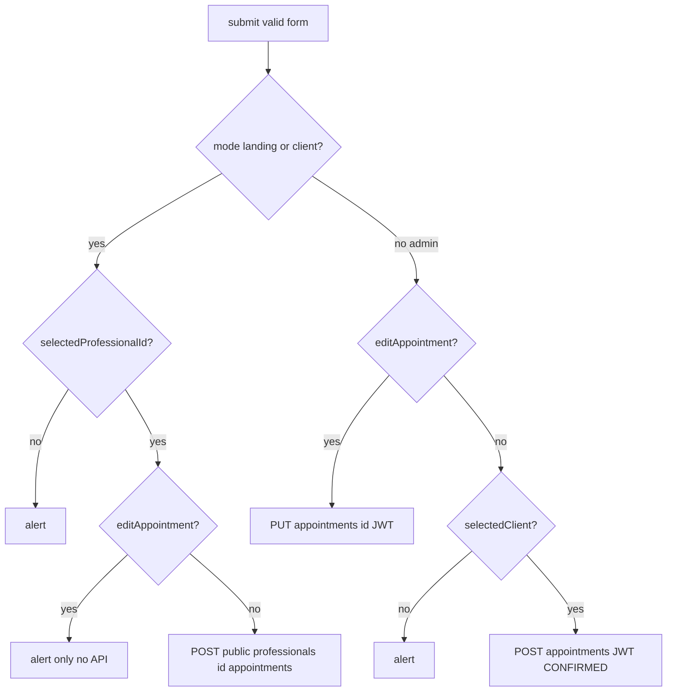

# Entendimento do `submit()` e integração com o Java

## Papel do componente

[`booking-form.component.ts`](frontend/src/app/shared/components/booking-form/booking-form.component.ts) usa `mode = input<'landing' | 'client' | 'admin'>('landing')` e decide:

- Onde buscar empresa/profissional (landing/cliente carregam empresas; admin fixa o profissional logado em `ngOnInit`).
- Se o submit vai pelo **público** ou pelo **admin**.

O `submit()` (linhas 302–382) só envia dados; a montagem do formulário, slots ocupados e horários vêm de `effects` que chamam `PublicBookingService` (GETs em `/public/...`).

---

## Ramo 1: `mode === 'landing' || mode === 'client'`

**Condições:** formulário válido e `selectedProfessionalId()` preenchido (senão alerta e retorna).

**Payload Angular:** `{ client: { name, email, phone }, selectedServices, date, time }` — alinhado ao DTO Java [`PublicAppointmentRequest`](backend/src/main/java/com/belezapro/belezapro_api/features/appointments/models/PublicAppointmentRequest.java) (`client`, `selectedServices`, `date`, `time`).

### Se `editAppointment()` existe (reagendamento)

- O código **não chama API**: exibe `alert("Edição no portal do cliente em desenvolvimento no backend")`.
- A variável `id` obtida de `editAppointment()!.id` **não é usada** (código morto / preparação futura).
- No backend, [`ClientPortalController`](backend/src/main/java/com/belezapro/belezapro_api/features/appointments/controllers/ClientPortalController.java) expõe apenas **GET** (lista, empresas, `/me`) — **não há endpoint de atualização** de agendamento para `ROLE_CLIENT`. Ou seja: o “buraco” é **front + back** para reagendamento autenticado como cliente.

### Se não é edição (criação)

- Chama [`PublicBookingService.createAppointment(professionalId, payload)`](frontend/src/app/core/services/public-booking.service.ts) → **POST** `/api/v1/public/professionals/{professionalId}/appointments`.

**Java:** [`PublicBookingController.createAppointment`](backend/src/main/java/com/belezapro/belezapro_api/features/appointments/controllers/PublicBookingController.java) (linhas 79–131):

1. Resolve o **usuário cliente** por e-mail (`Role.CLIENT`): cria novo `User` ou atualiza nome/telefone se já existir.
2. Monta `Appointment` com `clientId`, `serviceIds` ← `selectedServices`, `date`, `startTime` ← `time`, preenche `companyId` a partir do profissional.
3. Delega a [`AppointmentService.create(professionalId, appointment)`](backend/src/main/java/com/belezapro/belezapro_api/features/appointments/services/AppointmentService.java): o `professionalId` vira **`adminId`** do agendamento (profissional = dono do slot).
4. Status: se `null`, vira **`PENDING`** (linhas 61–62) — mesmo para visitante ou cliente logado; não há ramo especial “cliente autenticado” neste endpoint.
5. Cria vínculo `ClientAdminLink` se ainda não existir entre cliente e profissional.

**Autenticação HTTP:** rotas `/api/v1/public/**` são excluídas do interceptor JWT no backend ([`WebConfig`](backend/src/main/java/com/belezapro/belezapro_api/config/WebConfig.java) — `excludePathPatterns("/api/v1/public/**")`). O front pode até enviar `Authorization` ([`auth.interceptor.ts`](frontend/src/app/core/interceptors/auth.interceptor.ts)) se houver token, mas o endpoint público **não exige** JWT.

**Pós-sucesso no front:** alerta, `authService.updateUserName` se houver nome, `finished.emit()`, `reset()`.

---

## Ramo 2: `mode === 'admin'`

Usa [`AppointmentService`](frontend/src/app/core/services/appointment.service.ts), que bate em [`AppointmentController`](backend/src/main/java/com/belezapro/belezapro_api/features/appointments/controllers/AppointmentController.java) sob **`/api/v1/appointments`**, anotado com **`@RequireRoles({ "ADMIN", "ROOT" })`**. O `adminId` efetivo vem do JWT (`authenticatedUserId` no request).

### Se `editAppointment()` existe

- **PUT** `/api/v1/appointments/{id}` com corpo `Appointment` mesclado (`serviceIds`, `date`, `startTime` do form + demais campos do `editApp`).
- Java: `update(adminId, id, incoming)` — só permite se `existing.adminId` == admin logado; atualiza cliente, serviços, data, hora, status; chama `enrichAppointmentData`.

### Se é criação

- Exige `selectedClient()` (senão alerta).
- **POST** `/api/v1/appointments` com `clientId`, `serviceIds`, `date`, `startTime`, `status: CONFIRMED`.
- Java: `create(adminId, data)` — define `adminId` pelo token, default de status seria `PENDING` se null, mas aqui o front manda **CONFIRMED**; cria `ClientAdminLink` se necessário; enriquece preços/duração a partir dos serviços do **mesmo** `adminId`.

---

## Diagrama do `submit()`

---

## Pontos importantes para próximos ajustes

1. **Landing e client** no create usam o **mesmo** endpoint público e o mesmo modelo de negócio (cliente por e-mail, status inicial **PENDING**). Diferença é só UX (dados pré-preenchidos no modo cliente).
2. **Reagendamento cliente** com `editAppointment` está **bloqueado no UI** e **sem API** no `ClientPortalController` — qualquer feature de reagendamento exigirá novo endpoint (ou reutilização controlada do público com regras) + implementação no `submit()`.
3. **Admin** sempre usa o profissional **logado** (`selectedProfessionalId` setado com `me.id`); não passa `professionalId` na URL — o vínculo é só pelo JWT.
4. **Consistência de nomes:** público usa `time` / `selectedServices`; admin usa `startTime` / `serviceIds` no corpo REST — normalizado nos serviços/DTOs de cada lado.

Nenhuma alteração de código foi feita; este documento serve de base para os ajustes que vocês forem planejar.
