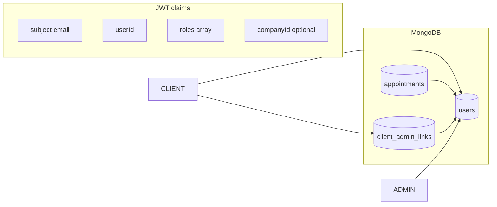

# Contextos, roles e entidades MongoDB (BelezaPro)

## O que significa “contextos” na documentação

No projeto, **contexto** não é um pacote DDD nomeado “Context” no código; é o **mapa mental do produto e da arquitetura**, descrito principalmente em [.doc/planos-acao/belezapro_contexto_monorepo_4a5f3787.plan.md](.doc/planos-acao/belezapro_contexto_monorepo_4a5f3787.plan.md).

### Três contextos de uso (produto / rotas)

| Contexto | Rotas (frontend) | API típica | Autenticação |
|----------|------------------|------------|--------------|
| **Reserva pública** | `/booking` | `PublicBookingController` (`/api/v1/public`) | Sem JWT obrigatório para criar reserva |
| **Portal do cliente** | `/entrar`, `/client/*` | `AuthController` (OTP), `ClientPortalController` | OTP → JWT com role `CLIENT` |
| **Painel admin** | `/admin/*` | Agendamentos, clientes, catálogo, agenda, despesas, usuários | Login senha → JWT com `ADMIN` ou `ROOT` |

Guards no Angular (`adminGuard`, `clientGuard`, `rootGuard`) espelham esse recorte no cliente; detalhes em [frontend/docs/architecture.md](frontend/docs/architecture.md).

### Contextos técnicos (frontend)

A pasta [frontend/docs/architecture.md](frontend/docs/architecture.md) descreve **core** (serviços globais, guards, modelos TS), **shared** (componentes reutilizáveis) e **features** (`admin`, `client`, `public`). Isso organiza o código por “quem usa”, alinhado aos três contextos de produto acima.

### Documentação vs implementação

- [belezapro_contexto_monorepo_4a5f3787.plan.md](.doc/planos-acao/belezapro_contexto_monorepo_4a5f3787.plan.md) indica que **despesas** no admin já foram descritas como só `localStorage`; o backend **já possui** modelo e API de despesas (`Expense`, `ExpenseController`). Vale tratar isso como doc desatualizada nesse ponto.
- O mesmo plano avisa que o [frontend/README.md](frontend/README.md) pode ainda citar SQLite/Express para SSR — o backend deste monorepo é **Spring Boot + MongoDB**.

---

## Roles (fonte de verdade: backend)

Enum em [backend/src/main/java/com/belezapro/belezapro_api/features/users/models/Role.java](backend/src/main/java/com/belezapro/belezapro_api/features/users/models/Role.java):

- **ROOT** — gestão global de usuários (`UserController` só aceita esta role).
- **ADMIN** — operação do salão (empresa em `companyId`): agendamentos, clientes, catálogo, agenda, despesas (conforme anotações nos controllers).
- **CLIENT** — portal do cliente após OTP.

O JWT inclui `roles` como **array de strings iguais ao `Role.name()`** (`ROOT`, `ADMIN`, `CLIENT`) — ver [JwtTokenService](backend/src/main/java/com/belezapro/belezapro_api/features/authentication/services/JwtTokenService.java). O [AuthInterceptor](backend/src/main/java/com/belezapro/belezapro_api/features/authentication/interceptor/AuthInterceptor.java) valida `@RequireRoles` contra esse claim.

Fluxo relevante:

- **Admin:** `AuthService.authenticate` → usuário em `users` com senha hash.
- **Cliente:** primeiro OTP válido cria usuário `CLIENT` sem `companyId` se o e-mail ainda não existir — [AuthService.validateOtp](backend/src/main/java/com/belezapro/belezapro_api/features/authentication/services/AuthService.java).

---

## Coleções MongoDB (`@Document`)

| Coleção | Modelo Java | Papel |
|---------|-------------|--------|
| `users` | [User](backend/src/main/java/com/belezapro/belezapro_api/features/users/models/User.java) | Staff (ADMIN/ROOT com `companyId`) e clientes de portal (CLIENT); inclui `role`, `companyId`, bloqueio |
| `companies` | [Company](backend/src/main/java/com/belezapro/belezapro_api/features/companies/models/Company.java) | Salão / tenant |
| `appointments` | [Appointment](backend/src/main/java/com/belezapro/belezapro_api/features/appointments/models/Appointment.java) | `companyId`, `adminId`, `clientId` + snapshot `clientName` / `clientEmail` / `clientPhone` |
| `services` | [ServiceItem](backend/src/main/java/com/belezapro/belezapro_api/features/services/models/ServiceItem.java) | Catálogo (há `adminId` no modelo — multi-admin) |
| `schedule_configs` | [ScheduleConfig](backend/src/main/java/com/belezapro/belezapro_api/features/schedule/models/ScheduleConfig.java) | Grade semanal |
| `schedule_overrides` | [ScheduleOverride](backend/src/main/java/com/belezapro/belezapro_api/features/schedule/models/ScheduleOverride.java) | Exceções de data |
| `otps` | [Otp](backend/src/main/java/com/belezapro/belezapro_api/features/authentication/models/Otp.java) | Códigos descartáveis para login cliente |
| `client_admin_links` | [ClientAdminLink](backend/src/main/java/com/belezapro/belezapro_api/features/clients/models/ClientAdminLink.java) | Vínculo `userId` (cliente) ↔ `adminId` (índice único composto) |
| `expenses` | [Expense](backend/src/main/java/com/belezapro/belezapro_api/features/expenses/models/Expense.java) | Despesas por `adminId` |

**Observação de modelo:** não existe coleção `clients` separada. O “cliente de negócio” aparece como **usuário `CLIENT` em `users`**, **dados redundantes no agendamento**, e **associação opcional** em `client_admin_links`. O [frontend/docs/models.md](frontend/docs/models.md) descreve uma visão de domínio tipo “Client” como interface — útil conceitualmente, mas o espelho físico no Mongo é essa combinação.

Campos de auditoria comuns: [Auditable](backend/src/main/java/com/belezapro/belezapro_api/common/models/Auditable.java) (`createdAt`, `updatedAt`).

---

## Implicações para modificações futuras

- Qualquer **nova role** ou permissão fina exige: enum `Role`, geração de JWT, `@RequireRoles` nos controllers e guards/claims no Angular.
- Mudanças em **“entidade cliente”** devem considerar os três lugares: documento `users` (CLIENT), snapshot em `appointments`, e `client_admin_links`.
- **Multi-tenant** hoje gira em torno de `companyId` no usuário staff e `companyId` nos agendamentos/serviços conforme regras de cada feature — revisar serviços ao alterar isolamento.

Nenhuma alteração de código foi feita; este documento serve como linha de base antes de desenhar mudanças específicas em roles ou schema.
