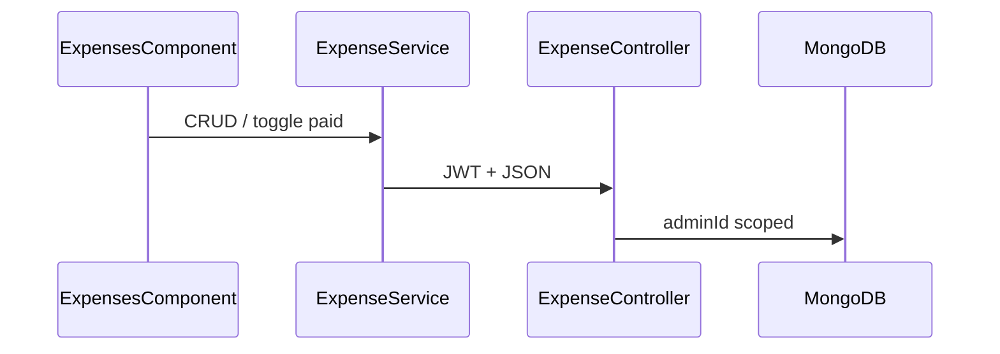

# Plano: despesas no Java/MongoDB (sair do localStorage)

## Situação atual

- **Frontend:** [`expense.service.ts`](frontend/src/app/core/services/expense.service.ts) persiste em `localStorage` via [`LocalStorageRepository`](frontend/src/app/core/repositories/local-storage.repository.ts) (`salon_expenses`). Operações: listar (signal), criar (UUID), atualizar, excluir, alternar `isPaid`, filtros por mês/ano e `calculateTotals`.
- **Modelo:** [`Expense`](frontend/src/app/core/models/salon.models.ts) — `id`, `description`, `amount`, `date` (YYYY-MM-DD), `category` (`ExpenseCategory` com valores em português, ex. `'Materiais'`), `isPaid`.
- **Tela:** [`expenses.component.ts`](frontend/src/app/features/admin/expenses/expenses.component.ts) + modais — chamadas síncronas ao service; sem loading/erro de rede.
- **Backend:** nenhum código de despesas; padrão de **tenant** = `authenticatedUserId` como em [`ScheduleController`](backend/src/main/java/com/belezapro/belezapro_api/features/schedule/controllers/ScheduleController.java) (`@RequireRoles({"ADMIN", "ROOT"})`).

---

## Backend (Spring + MongoDB)

1. **Pacote** `features/expenses/` (ou nome alinhado ao restante do projeto): `models`, `repositories`, `services`, `controllers`.

2. **Modelo `Expense` (documento Mongo)**  
   - `@Document(collection = "expenses")`, estender [`Auditable`](backend/src/main/java/com/belezapro/belezapro_api/common/models/Auditable.java) se o projeto já habilita `@CreatedDate` / `@LastModifiedDate` nos outros aggregates.  
   - Campos: `id`, `adminId` (índice composto com `date` ou consulta por intervalo), `description`, `amount` (`BigDecimal`), `date` (`String` YYYY-MM-DD, igual ao front), `category` (enum Java com `@JsonValue` ou nomes que casem com o JSON atual — os valores do TS são strings PT), `isPaid` (`boolean`).

3. **`ExpenseRepository`**  
   - `findByAdminIdOrderByDateDesc` ou consulta por `adminId` + intervalo de datas quando `month`/`year` forem passados (evita trazer histórico inteiro na medida do possível).

4. **`ExpenseService`**  
   - `list(adminId, month?, year?)` — filtro opcional no servidor.  
   - `create(adminId, dto)`, `update(adminId, id, dto)`, `delete(adminId, id)` — em update/delete, validar `existing.adminId.equals(adminId)` (mesmo padrão de [`AppointmentService.update`](backend/src/main/java/com/belezapro/belezapro_api/features/appointments/services/AppointmentService.java)).  
   - `setPaid(adminId, id, boolean)` ou toggle — um único `PATCH` é suficiente.

5. **`ExpenseController`** — `@RequestMapping("/api/v1/expenses")`, `@RequireRoles({"ADMIN", "ROOT"})`  
   - `GET` — query params opcionais `month`, `year` (inteiros).  
   - `POST` — corpo DTO sem `id`/`adminId`.  
   - `PUT /{id}` — corpo completo (ou parcial, se preferir).  
   - `DELETE /{id}`.  
   - `PATCH /{id}/paid` — corpo `{ "paid": true }` ou só toggle; alinhar com o front (`togglePaidStatus`).

6. **DTOs** — request de criação/atualização sem expor `adminId`; resposta espelha o documento para o Angular reutilizar o mesmo `Expense` (com `id` gerado pelo Mongo).

7. **Documentação** — Springdoc passa a expor os endpoints; opcional entrada Bruno em [`.doc/bruno`](.doc/bruno).

---

## Frontend (Angular)

1. **`ExpenseService`**  
   - Remover dependência de `LocalStorageRepository` e `STORAGE_KEY`.  
   - Injetar [`ApiService`](frontend/src/app/core/services/api.service.ts).  
   - Manter `expenses` como `signal` atualizado após cada `GET` bem-sucedido (ou após cada mutação com resposta).  
   - Implementar: `loadExpenses(month?, year?)` (chamado no construtor/init e quando o usuário mudar mês/ano na tela), `addExpense`, `updateExpense`, `deleteExpense`, `togglePaidStatus` via `POST`/`PUT`/`DELETE`/`PATCH`.  
   - IDs passam a ser os do backend (string Mongo).  
   - Manter `filterByMonth` / `calculateTotals` como utilitários locais **ou** confiar só no filtro do servidor + lista já filtrada (recomendado: **GET com month/year** alinhado ao seletor da tela para menos dados e consistência).

2. **`ExpensesComponent`**  
   - Após salvar/excluir/toggle: aguardar subscribe (ou `firstValueFrom`) e então `loadExpenses` ou usar resposta do servidor.  
   - Opcional: pequeno estado de loading/erro (toast ou mensagem) — melhora UX; pode ser fase 2.

3. **`ExpenseModalComponent`** — sem mudança de contrato se o service continuar emitindo `Omit<Expense, 'id'>` na criação.

4. **SSR** — como outros serviços HTTP, garantir que `loadExpenses` não quebre no servidor (lista vazia ou não chamar até `isPlatformBrowser` se necessário; seguir o padrão de [`AppointmentService`](frontend/src/app/core/services/appointment.service.ts) / guards).

---

## Migração de dados localStorage (opcional)

- Não é obrigatório para o MVP: usuários perdem despesas antigas locais **ou** pode-se acrescentar depois um botão “Importar do navegador” que lê `salon_expenses` e faz `POST` em lote. Mencionar no README/changelog se não implementar.

---

## Testes manuais sugeridos

- ADMIN: CRUD + filtro mês/ano + pago/pendente.  
- Dois admins diferentes: despesas isoladas.  
- ROOT: mesmo contrato que schedule (despesas ligadas ao usuário autenticado).

---

## Ordem de implementação sugerida

1. Backend: modelo + repository + service + controller + smoke via Swagger/Bruno.  
2. Frontend: `ExpenseService` HTTP + ajuste `ExpensesComponent` (reload / subscribe).  
3. Remover referências mortas ao `salon_expenses` no código (e atualizar [frontend/README](frontend/README.md) se ainda citar despesas só em localStorage).
