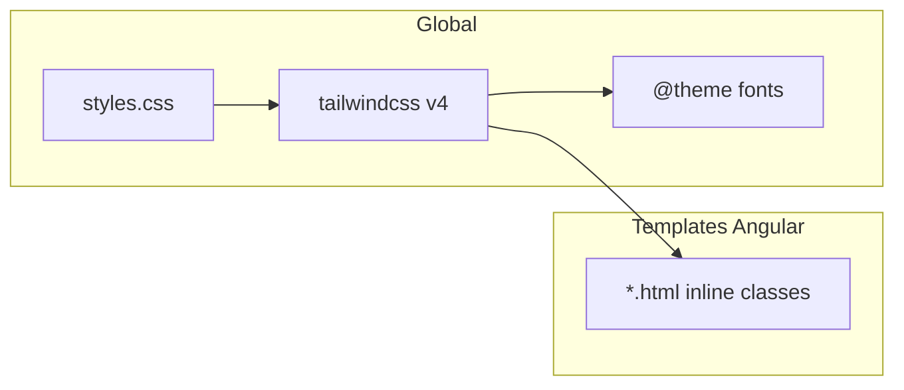

# Plano: configuração e evolução dos estilos (BelezaPro)

## Estado atual (o que o projeto já usa)

| Camada | Uso hoje |
|--------|----------|
| **Framework** | Angular 21 (standalone), build [`@angular/build:application`](frontend/angular.json) |
| **CSS global** | Um único entry: [`frontend/src/styles.css`](frontend/src/styles.css) — `@import "tailwindcss"`, `@theme` só com `--font-sans` / `--font-serif`, Google Fonts (Inter + Playfair) e ícones Material via URL |
| **Escopo local** | [`frontend/src/app/app.css`](frontend/src/app/app.css) vazio; praticamente **nenhum** `styleUrl` em componentes — quase tudo é classe Tailwind **inline nos HTML** |
| **UI lib** | `@angular/material` instalado; na prática só [`MatIconModule`](frontend/src/app/features/admin/layout/admin-layout.component.ts) + fonte Material Icons (sem tema M2/M3 importado em SCSS/CSS) |
| **Animação** | Classes `animate-in`, `fade-in`, `zoom-in`, `slide-in-from-top-4` em modais e filtros; **não há** `tailwindcss-animate` nem `@plugin` equivalente no [`package.json`](frontend/package.json) — essas classes tendem a **não gerar CSS** e ficar só no markup (comportamento alinhado ao que [frontend/docs/modals.md](frontend/docs/modals.md) descreve, mas sem suporte no build) |
| **Outra dep** | [`motion`](frontend/package.json) declarado e **sem imports** em `frontend/src` (candidato a remover ou passar a usar de propósito) |

Fluxo mental: **Tailwind utilities → templates**; tokens mínimos; documentação de modais já existe e pode guiar refactors.

## Problemas / oportunidades (prioridade)

1. **Repetição visual** — O mesmo “bloco” aparece em muitos arquivos (ex.: shell de modal: `bg-white w-full max-w-md rounded-3xl shadow-2xl overflow-hidden animate-in fade-in zoom-in duration-200` em [confirm-modal.html](frontend/src/app/shared/components/confirm-modal/confirm-modal.html) e várias modais em `features/**`).
2. **Design system frágil** — Paleta e raios vêm do default Tailwind (`stone-*`, `rounded-3xl`); não há **variáveis de marca** centralizadas no `@theme` (além das fontes), o que dificulta consistência e futura troca de tema.
3. **Animações documentadas mas não garantidas no build** — Corrigir ou substituir por `@keyframes` / Motion de forma explícita.
4. **`app.css` morto** — Ou passa a importar camadas parciais (`@import "./styles/..."`) ou some do componente raiz para evitar confusão.
5. **Material** — Hoje é “ícone + fonte”; se no futuro entrarem `mat-dialog`, `mat-form-field`, etc., será preciso **tema Material** (CSS ou SCSS M3) para não brigar com Tailwind.

## Direção recomendada (mudanças planejadas)

### Fase A — Fundação (baixo risco, alto ganho)

- **Expandir [`@theme`](frontend/src/styles.css)** com tokens que espelhem o que já usam: cores de superfície/borda/texto (mapeando `stone` para nomes semânticos se desejarem, ex. `--color-surface`, `--color-border-subtle`), raios (`--radius-card`, `--radius-control`), sombras, espaçamentos de layout (sidebar, modal max-width).
- **Extrair CSS em camadas** (opcional mas limpo): por exemplo `frontend/src/styles/tokens.css`, `base.css`, `components.css` importados só em `styles.css`, mantendo um único entry no [`angular.json`](frontend/angular.json).
- **Component utilities Tailwind v4**: definir `@utility` ou blocos reutilizáveis para padrões que se repetem ≥3 vezes: **shell de modal**, **label de formulário**, **input filled**, **botão primário/secundário**, **nav link ativo** (hoje espelhado em [admin-layout.html](frontend/src/app/features/admin/layout/admin-layout.html) e similares).

### Fase B — Animações e alinhamento com a doc

- **Escolher uma estratégia única** e documentar em [modals.md](frontend/docs/modals.md):
  - **Opção 1:** plugin/compatível com Tailwind v4 para classes `animate-in` / `fade-in` / etc., **ou**
  - **Opção 2:** `@keyframes` + classes curtas no `@theme` / `@layer components`, **ou**
  - **Opção 3:** usar [`motion`](https://motion.dev/) nos poucos pontos que precisam (modais), e remover a dep se não for adotada.
- Garantir que o que está escrito na doc **corresponde ao CSS gerado** (hoje há descompasso).

### Fase C — Consistência Angular + menos ruído nos templates

- **Wrapper de modal** (componente leve com `ng-content`) para o “card” branco + overlay, deixando só header/body por feature — reduz diffs e divergências com [modals.md](frontend/docs/modals.md).
- **Padronizar `mat-icon`**: hoje há override local em [auth-selection.component.ts](frontend/src/app/features/public/auth-selection/auth-selection.component.ts); avaliar **uma regra global** em `styles.css` (tamanho base, `width/height: auto` onde fizer sentido) para não repetir `class="text-[20px] w-[20px] h-[20px]"` em vários lugares.
- **Material Icons**: médio prazo, considerar **Material Symbols / SVG** ou subset para performance; curto prazo, manter fonte se o custo de bundle for aceitável.

### Fase D — Qualidade de DX (quando fizer sentido)

- **Prettier plugin Tailwind** ou ESLint rule para ordenação de classes (opcional).
- **Dark mode**: só entrar no `@theme` se for requisito de produto; hoje a UI é clara (`bg-white`, `stone-50`).

## Arquivos centrais a tocar (implementação futura)

- [`frontend/src/styles.css`](frontend/src/styles.css) — núcleo de tokens e imports.
- [`frontend/angular.json`](frontend/angular.json) — só se adicionarem mais entradas globais.
- Templates em [`frontend/src/app/**/*.html`](frontend/src/app) — migração gradual de strings longas para `@utility` / componentes.
- [`frontend/docs/modals.md`](frontend/docs/modals.md) — manter como contrato visual após fix de animações.

## Riscos e mitigação

- **Tailwind v4 + Angular**: manter um único pipeline (`@import "tailwindcss"`) evita duplicar PostCSS; testar após mudanças em `@theme` (especialmente se renomearem classes usadas em templates).
- **Orçamento de estilo por componente** em produção: [`anyComponentStyle`](frontend/angular.json) 4kB / 8kB — se migrarem estilos para `styleUrl` por componente, monitorar tamanho.

## Decisão opcional (produto)

Se quiserem **tema escuro** ou **marca com cor primária** (não só neutros), isso deve refletir primeiro no `@theme` antes de refatorar templates — evita retrabalho.
