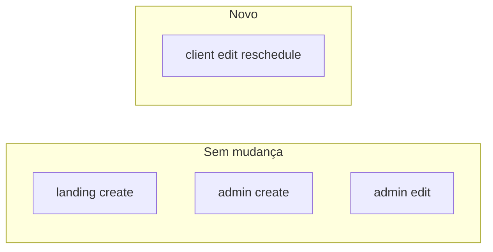

# Plano: reagendar na tela do cliente sem impactar outras telas

## Onde o `BookingForm` é usado hoje

| Tela | Uso | `mode` | `editAppointment` |
|------|-----|--------|-------------------|
| [booking-page.html](frontend/src/app/features/public/landing/booking-page.html) | `<app-booking-form></app-booking-form>` | default `landing` | nunca passado |
| [client-booking-modal.html](frontend/src/app/features/client/appointments/client-booking-modal/client-booking-modal.html) | `mode="client"` | opcional (novo vs edição) |
| [appointment-booking-modal (admin)](frontend/src/app/features/admin/appointments/appointment-booking-modal/booking-modal.html) | `mode="admin"` | edição/novo | sim |
| [booking-modal (admin clientes)](frontend/src/app/features/admin/clients/booking-modal/booking-modal.html) | `mode="admin"` + `selectedClient` | só criação | não |

O **submit** já separa **(landing | client)** vs **admin** em dois blocos distintos ([linhas 306–381](frontend/src/app/shared/components/booking-form/booking-form.component.ts)). Qualquer lógica de reagendamento deve ficar **somente** no primeiro bloco, condicionada a `mode() === 'client'`, para o ramo **admin** continuar idêntico (PUT `/appointments/{id}`).

---

## Backend (Java)

**Objetivo:** o cliente autenticado (`ROLE_CLIENT`) só pode alterar **seus** agendamentos; não reutilizar `AppointmentController.update` (exige `ADMIN`).

1. **DTO** (novo, enxuto), por exemplo `ClientRescheduleRequest`: `List<String> serviceIds`, `String date`, `String startTime` (espelha o que o formulário já coleta).

2. **`AppointmentService`** (novo método, ex.: `rescheduleByClient(String clientId, String appointmentId, ClientRescheduleRequest req)`):
   - Carregar agendamento por id; se ausente → 404.
   - Se `!existing.getClientId().equals(clientId)` → 403.
   - Opcional (recomendado): rejeitar se `status` for `CANCELLED` ou se data/hora já passaram (regra de produto a definir).
   - Atualizar `serviceIds`, `date`, `startTime` no documento existente; **não** permitir trocar `clientId` nem `adminId` (permanecem os do registro).
   - Chamar `enrichAppointmentData(existing.getAdminId(), existing)` para recalcular nomes/preço/duração (reuso do fluxo atual).

3. **`ClientPortalController`**: expor **PUT** `/api/v1/client-portal/appointments/{id}` com `@RequireRoles({"CLIENT"})`, corpo `ClientRescheduleRequest`, delegando ao novo método. O `clientId` vem do mesmo mecanismo já usado em GET (`authenticatedUserId`).

4. **Documentação:** Springdoc passa a listar o endpoint; opcional alinhar Bruno em [`.doc/bruno`](.doc/bruno).

**Nota:** o cancelamento hoje em [client-appointments.component.ts](frontend/src/app/features/client/appointments/client-appointments.component.ts) usa `AppointmentService.update` (admin), o que tende a falhar — é problema separado; o reagendamento novo não depende disso.

---

## Frontend (Angular)

1. **`ClientPortalService`**: método `rescheduleAppointment(id: string, body: { serviceIds: string[]; date: string; startTime: string })` → **PUT** `/client-portal/appointments/{id}` (prefixo relativo como nos outros métodos).

2. **`BookingFormComponent`**:
   - Garantir injeção de `ClientPortalService` (hoje está `optional: true` — pode tornar obrigatório **ou** manter optional e usar `inject(..., { optional: true })` com fallback só no ramo client; o mais simples é **obrigatório**, pois o serviço é `providedIn: 'root'` e não quebra admin).
   - No bloco `if (this.mode() === 'landing' || this.mode() === 'client')`:
     - Se `this.editAppointment()`:
       - Se **`mode() === 'client'`**: montar payload a partir de `getRawValue()` (`selectedServices` → `serviceIds`, `date`, `time` → `startTime`), chamar `rescheduleAppointment(editAppointment!.id, ...)`, tratar erro/sucesso como no create (alert + `finished.emit()` + reset ou só emit + fechar modal).
       - Se **`mode() === 'landing'`** e ainda assim houver `editAppointment` (hoje não ocorre): manter comportamento defensivo (alert ou no-op) — **não** chamar API pública de create.
     - Senão: manter `publicBookingService.createAppointment` como hoje.

3. **Templates:** [client-booking-modal.html](frontend/src/app/features/client/appointments/client-booking-modal/client-booking-modal.html) já passa `[editAppointment]`; **nenhuma** mudança necessária em [booking-page](frontend/src/app/features/public/landing/booking-page.html) nem nos modais admin.

---

## Garantias de não-regressão

- **Admin:** ramo `else` do `submit()` (linhas 339–381) **intocado**.
- **Landing:** só passa pelo `create` público; ramo de edição só executa com `editAppointment` — hoje só o modal cliente define isso.
- **Contratos:** novo endpoint não altera `/public/...` nem `/appointments` existentes.

---

## Testes manuais sugeridos

- Cliente: novo agendamento (POST público) e reagendar (PUT portal) — lista atualiza após `finished`.
- Admin: criar e editar agendamento como antes.
- Landing anônimo: fluxo só de criação.

---

## Decisão de produto (curta)

Definir se reagendamento volta status para `PENDING` ou mantém `CONFIRMED` — o método de serviço pode fixar isso explicitamente para evitar ambiguidade.
